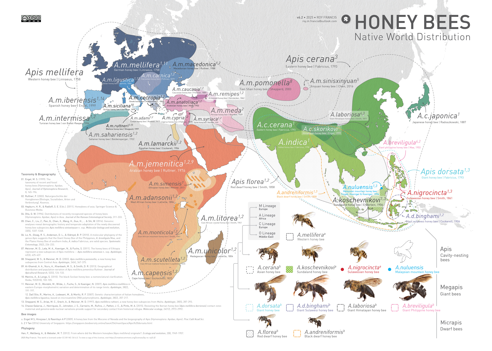

# Honey Bees | Native World Distribution Map

Annotated map showing the native distribution of honey bee species and subspecies around the world.

---

© 2025 • Roy Francis • <a href="https://creativecommons.org/licenses/by-nc-sa/4.0/?ref=chooser-v1" target="_blank" rel="license noopener noreferrer" style="display:inline-block;">CC BY-NC-SA 4.0 </a>
